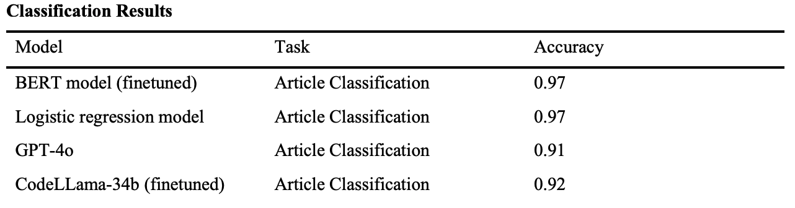
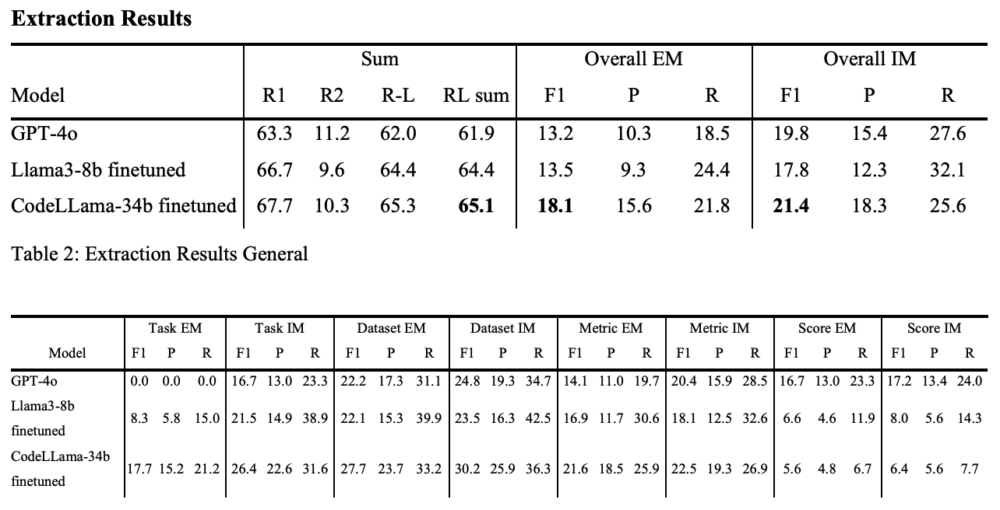

# CLEF SimpleText Task 4 - State-of-the-Art?
This project was part of the UNISG CS Master's course "Natural Language Processing with Deep Learning" (HS24).
It aims to address the overwhelming number of AI research papers and the absence of automated tools to extract their most relevant information.
The project was based on the CLEF SimpleText Task 4 initiative (https://github.com/jd-coderepos/sota/). 

## Methodology
The project was divided into two parts:
1. Classification of the papers
    - Does the paper contain a TDMS tuples or not?
2. Extraction of the relevant information from the papers
    - Extract the TDMS tuples from the paper.

### Data Preprocessing
The provided dataset is a dataset dump from paperswithcode.com and contains 12'288 AI papers as Latex files, each accompained with an annotaions.json file
The annotations.json file contain either
- the word "unanswerable" if the paper does not contain a TDMS tuple
- the reported TDMS tuples in the format [{‘LEADERBOARD’: {‘Task’: ‘task, ‘Dataset’: ‘dataset’, ‘Metric’: ‘metric’, ‘Score’: ‘score’}}]

**important to note that the accompaining annotations.json file often contain tuples that do not appear in corresponding paper due to human error in the annotation process**
**Only between 42.7% and 60.2% of the annotated TDMS can be found in the accompanied paper**

We only considered articles from the training set that contain at least one full TDMS tuple from its accompaining annotations.json file.
The Latex files were reduced to only conatin the most important content for the extraciotn task to reduce noisy data
-  The files were reduces to Title, Abstract, Experimental section, Results and Tables.
The Latex tags are kept because they can deliver additional information on the releveande of data (textbf{} etc.) 
Citations were removed
Due to the finetuning constraint of maximun context lenght, in this case 8'192 tokes for the used Llama-3 model only texts that that are below 7'000 tokens were considered.

This resulted in a Dataset of 700 papers and annotations to use for the finetuning.

For the classifcation task all 12'288 papers were used.

### Article Classification
The goal of the classification is to predict whether a paper contains a TDMS tuple or not (binary classification).
Two different approaches were taken:
1. Finetuning a BERT model 
    - finetuned with the 12'288 AI shortened papers and the corresponding labels (0 for no TDMS tuple, 1 for TDMS tuple)
2. Training a simple logistic regression model
    - The preprocessed papers were vectorized using TF-IDF and the labels like in the BERT finetuning.
    - up to 1000 iterations of training 

### Article TDMS Extraction

#### Prompting Schema
--------------------
To create a traning data sample the article and the annotations were inserted into a prompt template with an instruction, a text as as input and the annotations as output. 
The instruction is based on the extraction task and prompts the model to extract the TDMS tuples.
    
    Instruction:
    "“Your task is to extract all pertinent (Task, Dataset, Metric, Score) tuples from a given AI paper text.
    Your response is a list of JSONs of the tuples in the format [{'LEADERBOARD': {'Task': 'task', 'Dataset':
    'dataset', 'Metric': 'metric', 'Score': 'score'}}]. Make sure all of them are real compounds of pertinent
    (Task, Dataset, Metric, Score) tuples and do not include duplicates. Be very strict, only report the most
    pertinent tuples that were explicitly highlighted in the text. If you don't find any tuples in the text or you
    are not sure, respond with 'unanswerable'.""

The text input for the prompt is the shortened paper text.

The output of the prompt is the annotations in the format of a JSON list of dictionaries.

Final Prompt: 

"""### Instruction: 
{Instruction}

###Text:
{Shortened article}

###Response:
{Leadboard annotations}""""

#### LLM Fine-Tuning
--------------------
A Llama-3 8b as well as a CodeLlama 34b were fine-tuned for the TDMS extraction task.
900 Prompts created in during the data preprocessing phase were used.
Due to only having a A100 GPU and 40 VRAM using Google Colab open-source models and libraries (unsloth), which allow faster fine-tuning with less computational power, were used.

#### Inference 
--------------------
The inference aiming to extract the TDMS tuples on new unseen AI papers, the papers were reduced to its relevatn section similary to the training data.
The texts were reduced to 5'000 tokes to ensure enoguh free tokens for the generation of the TDMS tuples during inference.
The texts were again reduced to Title, Abstract, Experimental section and Tables just like the training data to ensure a consisten input format.
If the text was sill bigger than 5'000 tokens the ppaer was gradually reduced by first omitting the experiments section, then the results and finally crop the tables.

### Baseline
To compare the results of our models to a base model a large language model (GPT-4o) was used for both parts of the project due to its good performance on textual tasks.
The data and promptes were preprocessed and formatted in the same way as described for the inference of the fine tuned models. 

### Evaluation
The evaluation was done on the provided dataset consiting of 100 unseen papers containing 51 with TDMS tupes and 49 without.
The scoring is done via an automaed scoring algorithm provided on github by the organizers.
The algorithm calcualtes the classification accuracy, similarity between true and predicted annotations, exact and inexact matches for each tuple elemement (Task, Dataset, Metric and Score) as well as an overall exact & inexact match score of the tuples between the true and predicted annotations.

## Results 
### Classification
Following are the results for the classification task of the logistic regression model, the finetuned BERT model, GPT-4o and the finetuned CodeLlama 34b on the validation set.
The table shows the accuracy of each model predicting whether a paper contains a TDMS tuple or not.
**Note: GPT-4o and CodeLlama were not trained or prompted explicitly for this task, but as a combination of the classification and extraction task with the prompt above**
**The BERT model and the logistic regression model were specifically trained for the classification task**

The results show that the BERT model and the logistic regression model both perform very well with an accuracy of 97% on the deisgnated binary classification task even better than GPT-4o and CodeLlama which still perform very well with 91% and 92% accuracy.

### TDMS Extraction
The extraction task results are shown in the following table and are for GPT-4o, a finetuned Llama3-8b model and a finetuned CodeLlama 34b model.
The results are based on the score metrics introduced in the Evaluation section to calculate the similarity, as well as the inexact and exact match scores between the model predictions and the provided human-annotations for the 100 validation papers.
The models Llama3-8b and CodeLlama 34b without finetuning are not included due to the fact that this models were not capable of this task in general, either outputting unstructured data or responding with non-sensical outputs. 
This is why the results of the finetuned models are compared to more capable models like GPT-4o.

The 2 tables below show that GPT-4o performs better than the finetuned models in extracting the Score item of the TDMS tuples for exact and inexact matches.
For task, dataset and metric extraction, the finetuned CodeLlama 34b model outperforms the GPT-4o model and the finetuned Llama3-8b model.
The CodeLlama model also outperforms both the GPT-4o and the Llama3-8b model in summarization (Rouge metrics) and the overall exact and inexact match scores but only by a small margin.

The better performance of the CodeLlama 34b model compared to the Llama3-8b model can be explained by its size of 34 billion parameters compared to the Llama3-8b models 8 billion parameters.

## Discussion
The results show that the classification task is very well suited for a logistic regression model or a finedtuned BERT model and can achieve an accuracy of 97%.
Prompting llms such as GPT-4o or CodeLlama for the classification task also achieves a high accuracy of 91% and 92%.
Though the specifically trained models perform better in this task, the difference is not that large.

The extraction task results show that all models do not perform well, with the highest overall exact-match F1 score of 18.95 and inexact-match F1 score of 21.78.
This could indicate that using finetuned llms to extract TDMS tuples from AI papers is not applicable.
But there are 2 reasons why the shown results are not enough to determine the applicability and performance of finetuned llms for this task.
1. **Task, data and scoring are flawed**
    - The task, the provided data and the performance scoring are inherently flawed due to how the task is described and the data is annotated.
    - the extraction task is described as extracting the "pertinent" and "relevant" TDMS tuples, but this is very subjective and depends on the human annotators.
    - The training and validation data were annotated by the community on paperswithcode.com and depending on the annotators the annotations can vary significantly.
    - Another problem with the given dataset is that the annotations might be incomplete or even wrong. This can be seen by the fact that only between 42.7% and 60.2% of the annotated TDMS tuples can be found in the accompanied paper.
    - Essentially the data used for training and validation do not contain annotations that can be considered as ground truth.
2. **Computational Constraints**
    - Due to computational constraints only smaller models with 8 billion or 34 billion could be used for finetuning.
    - This led to faulty responses for some of the inference.
    - Larger models such as Llama3-80b might perform significantly better.

Looking at the results that show that finetuned llms for the extraction task perform slightly better than the unfinetuned models GPT-4o it can be assumed that finetuning llms is a valid approach for the extraction data from articles.
This is only under two conditions:
- The task is formulated precisely without any subjectivity and the data is of good quality.
- The computational power to finetune larger models is available so that larger models such as Llama3-80b can be used.

## References
Annual scholarly publications on artificial intelligence. https://ourworldindata.org/grapher/annualscholarly-publications-on-artificial-intelligence

D’Souza, J., Giglou H. B., Zhang Y. & Auer, S. (2024). SOTA?. https://sites.google.com/view/simpletextsota/home?authuser=0

D’Souza, J. (2024), sota. https://github.com/jd-coderepos/sota/

Dagdelen, J., Dunn, A., Lee, S. et al. Structured information extraction from scientific text with large language models. Nat Commun 15, 1418 (2024). https://doi.org/10.1038/s41467-024-45563-x

Kabongo, S., D'Souza, J., & Auer, S. (2023, June). Zero-shot entailment of leaderboards for empirical ai research. In 2023 ACM/IEEE Joint Conference on Digital Libraries (JCDL) (pp. 237-241). IEEE.

Kabongo, S., D’Souza, J., & Auer, S. (2024). ORKG-Leaderboards: a systematic workflow for mining leaderboards as a knowledge graph. International Journal on Digital Libraries, 25(1), 41-54.

OpenAI (2024, May 13). Hello GPT-4o. https://openai.com/index/hello-gpt-4o/